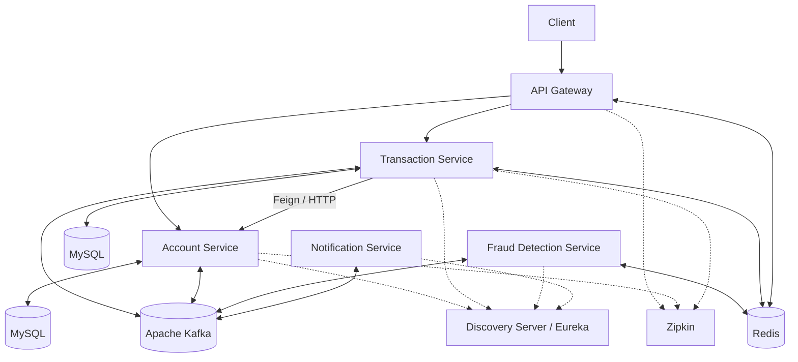
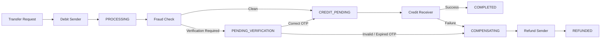

# Digital Banking System

A distributed digital banking backend built with **Java, Spring Boot, Apache Kafka, Redis, MySQL, and Spring Cloud**, designed to demonstrate reliable financial transactions across independently deployed microservices.

The system implements an **event driven Saga workflow** for fund transfers, using compensating transactions instead of distributed database transactions. Reliability mechanisms including the **Transactional Outbox Pattern, idempotent consumers, atomic balance updates, state-guarded transitions, Dead Letter Topics, and Resilience4j** protect transaction processing against partial failures, duplicate events, concurrency issues, and temporary service outages.

## Key Features

- Microservices based account management and fund transfers
- Event driven Saga choreography with automatic compensation
- Transactional Outbox Pattern for reliable Kafka publishing
- Idempotent Kafka consumers and refund processing
- Atomic balance updates preventing concurrent overdrafts
- Redis-based fraud detection and OTP verification
- Resilience4j Circuit Breaker and safe retry
- Kafka Dead Letter Topics for failed event processing
- Spring Cloud Gateway with Redis backed rate limiting
- Eureka service discovery
- Micrometer metrics and Zipkin distributed tracing
- k6 concurrency, stress, and load testing

---

## Architecture



### Services

| Service | Responsibility                                                       |
|---|----------------------------------------------------------------------|
| **API Gateway** | Routes client requests and applies Redis backed rate limiting        |
| **Account Service** | Account management, atomic debit/credit operations and refunds       |
| **Transaction Service** | Transfer lifecycle, Saga state management, OTP and compensation      |
| **Fraud Detection Service** | Redis backed transaction velocity and fraud checks                   |
| **Notification Service** | Consumes transaction events for user notifications                   |
| **Discovery Server** | Eureka service registration and discovery                            |
| **Payment Service** | Experimental service for future external payment gateway integration |

---

## Transaction Saga

Fund transfers use **Saga choreography**, allowing each microservice to maintain its own local transaction while coordinating the overall workflow through Kafka events.



1. The **Transaction Service** requests an atomic sender debit from the Account Service.
2. After the debit succeeds, the transaction and its corresponding event are persisted using the Transactional Outbox Pattern.
3. The **Fraud Detection Service** asynchronously evaluates the transaction.
4. Clean transactions proceed toward receiver credit, while suspicious transactions require OTP verification which are communicated  using **Notification Service**.
5. The **Account Service** credits the receiver and publishes confirmation. Only then does the Transaction Service mark the transfer `COMPLETED`.
6. If OTP verification or receiver credit fails, the Saga enters compensation and refunds the sender.

State guarded transitions and idempotent refund processing prevent competing Saga paths or duplicate events from causing double processing.

---

## Reliability & Distributed-System Design

| Mechanism                        | Purpose |
|----------------------------------|---|
| **Transactional Outbox**         | Keeps database changes and Kafka event publication consistent |
| **Idempotent Consumers**         | Prevents duplicate Kafka deliveries from repeating business operations |
| **Idempotent Refunds**           | Prevents duplicate compensation from crediting the sender multiple times |
| **Atomic Balance Updates**       | Prevents concurrent transfers from overdrawing an account |
| **State Guarded Transitions**    | Prevents competing Saga paths from modifying the same transaction |
| **Resilience4j Circuit Breaker** | Protects services from repeatedly calling unavailable dependencies |
| **Safe Retry**                   | Retries repeatable operations without blindly retrying financial mutations |
| **Dead Letter Topics**           | Isolates Kafka events that repeatedly fail processing |

The system uses an **at least once event delivery model with idempotent processing**, rather than assuming exactly once delivery.

### Atomic Balance Updates

Sender balance deduction is performed using a conditional database update:

```sql
UPDATE account
SET balance = balance - :amount
WHERE account_number = :accountNumber
  AND balance >= :amount
  AND account_status = 'ACTIVE';
```

The balance check and deduction occur atomically, preventing concurrent transfers from collectively withdrawing more money than the account contains.

---

## Fraud Detection & OTP Verification

The Fraud Detection Service asynchronously evaluates transactions using:

- Redis-backed transaction velocity tracking
- Suspicious transaction amount detection
- Balance-percentage checks
- Duplicate event-processing protection

Transactions requiring additional verification are moved to `PENDING_VERIFICATION`. An OTP is generated by the Transaction Service, stored in **Redis with a five minute TTL**, and sent to the Notification Service through Kafka.

A correct OTP allows the Saga to continue. Invalid or expired OTPs trigger compensation, while a scheduled expiry mechanism handles transactions where an OTP is never submitted.

---

## Observability

The system uses **Spring Boot Actuator, Micrometer, and Zipkin** for metrics and distributed tracing.

Synchronous HTTP/Feign calls propagate trace context across services, while custom Micrometer metrics track Saga compensation attempts and outcomes.

```text
Client
  │
  ▼
API Gateway
  │
  ▼
Transaction Service
  │
  ▼
Account Service
  │
  ▼
Zipkin
```

Kafka producer/consumer observation is also enabled. Because trace context is not currently persisted in transactional outbox records, asynchronous processing after the outbox boundary may appear as a separate trace.

---

## Performance & Load Testing

The system was tested using **k6** for concurrency correctness, API throughput, latency, and asynchronous Saga completion.

### Results

| Test | Result |
|---|---|
| **Concurrent Transfers** | 20 simultaneous ₹1,000 transfers against a ₹10,000 balance → exactly 10 succeeded, 10 rejected, **0 overdrafts** |
| **Read Stress Test** | **500 req/s**, 0 HTTP failures, **1.93 ms p95** |
| **Transfer API Load** | ~**598 req/s**, 0 HTTP failures, **50.51 ms p95** |
| **Saga Completion Test** | **100 transfer req/s for 1 minute**, 0 HTTP failures, **11.66 ms p95** |
| **Eventual Saga Completion** | **6,000 / 6,000 transactions completed** after asynchronous backlog processing |

The ~598 req/s result measures the rate at which the API can **accept and initiate transfer requests**, not completed distributed Sagas per second. Kafka and downstream Saga processing continue asynchronously after request acceptance.

The concurrency test also validated the atomic balance update: 20 simultaneous ₹1,000 transfer attempts against a ₹10,000 account allowed exactly 10 debits and rejected the remaining 10 after the balance reached zero.

---

## Technology Stack

| Category | Technology |
|---|---|
| **Backend** | Java, Spring Boot |
| **Microservices** | Spring Cloud, OpenFeign |
| **API Gateway** | Spring Cloud Gateway |
| **Service Discovery** | Netflix Eureka |
| **Event Streaming** | Apache Kafka |
| **Database** | MySQL, Spring Data JPA / Hibernate |
| **Caching / Temporary State** | Redis |
| **Resilience** | Resilience4j |
| **Observability** | Actuator, Micrometer, Zipkin |
| **Infrastructure** | Docker, Docker Compose |
| **Load Testing** | k6 |
| **Build** | Maven |

---

## Running Locally

### Prerequisites

- Java 21+
- Maven
- MySQL
- Docker & Docker Compose
- k6 *(optional)*

### 1. Clone the repository

```bash
git clone https://github.com/sufiyan438/Digital-Banking-System
cd Digital-Banking-System
```

### 2. Start infrastructure

Kafka, Redis, and Zipkin are provided through Docker Compose.

```bash
docker compose up -d
```

Infrastructure:

| Component | Address |
|---|---|
| Kafka | `localhost:9092` |
| Redis | `localhost:6379` |
| Zipkin | `localhost:9411` |

### 3. Configure MySQL

Configure your local MySQL credentials in:

```text
account-service/src/main/resources/application.yaml
transaction-service/src/main/resources/application.yaml
```

### 4. Start the services

Start the Discovery Server first:

```bash
cd discovery-server
mvn spring-boot:run
```

Then run the Account, Transaction, Fraud Detection, Notification, and API Gateway applications in separate terminals.

Eureka:

```text
http://localhost:8761
```

API Gateway:

```text
http://localhost:8080
```

Zipkin:

```text
http://localhost:9411
```

### 5. Run load tests

```bash
cd load-tests
k6 run <test-script>.js
```

---

## Limitations & Future Work

The project currently focuses on distributed transaction reliability rather than providing every component of a production banking platform.

- Add **OAuth2 / Keycloak** authentication and role-based authorization
- Complete the Razorpay payment gateway integration
- Containerize the complete microservice stack and deploy using **Kubernetes**
- Persist tracing context through the outbox to provide continuous asynchronous Saga traces

[//]: # (- Expand automated integration, failure injection, and distributed system testing)

---

## Author

Sufiyan

Motilal Nehru Naitonal Institute of Technology (MNNIT)

---

